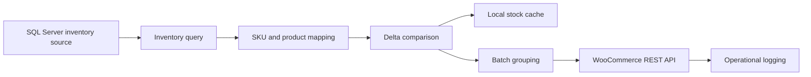

# Inventory Synchronization Architecture

## Flow

## Data-flow decisions

1. Read quantities from a controlled SQL Server inventory source.
2. Map each known SKU to either a simple product or a variation parent.
3. Compare the current quantity with the last successfully synchronized value.
4. Skip unchanged quantities to reduce unnecessary API traffic.
5. Group simple products and variations into separate update batches.
6. Treat a missing SKU as unknown, not as zero stock; warn and skip by default.
7. Update the cache only after the corresponding WooCommerce calls succeed.
8. In dry-run mode, calculate and report intended changes without sending them.

## Operational safeguards

Configuration is supplied through environment variables. A production design also
needs bounded timeouts, retry/backoff, graceful shutdown, and reviewable logs.
Those concerns are described here but their complete implementation is private.

## Boundaries

The public material stops at architecture and incomplete examples. It omits real
schema names, product identifiers, credentials, endpoints, and proprietary
business rules.
